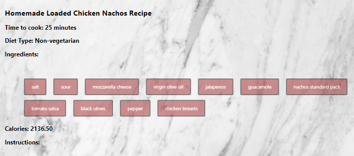

## STA(R) GEN: A STAR RECIPE GENERATOR 🍔


[](https://www.javascript.com/)
[](https://zenodo.org/badge/latestdoi/429944963)
[](https://github.com/thosaniparth/Recipe_Recommender/issues)
[](https://badgen.net/github/stars/thosaniparth/Recipe_Recommender)

[](https://app.travis-ci.com/thosaniparth/Recipe_Recommender)
[](https://codecov.io/gh/thosaniparth/Recipe_Recommender)
[](https://github.com/thosaniparth/Recipe_Recommender/actions/workflows/Respost.yml)
[](https://github.com/thosaniparth/Recipe_Recommender/actions/workflows/codeFormatter.yml)

[](https://github.com/thosaniparth/Recipe_Recommender/actions/workflows/close_as_a_feature.yml)
[](https://github.com/thosaniparth/Recipe_Recommender/actions/workflows/Code_Formatter_and_Syntax_Check.yml)
[](https://github.com/thosaniparth/Recipe_Recommender/actions/workflows/coverage.yml)
[](https://github.com/thosaniparth/Recipe_Recommender/actions/workflows/Style_Checker_and_Prettify_Code.yml)
[](https://github.com/thosaniparth/Recipe_Recommender/actions/workflows/greetings.yml)

[](https://github.com/thosaniparth/Recipe_Recommender/actions/workflows/label.yml)
[](https://github.com/thosaniparth/Recipe_Recommender/actions/workflows/stale.yml)


https://user-images.githubusercontent.com/25223347/140403709-a062e7c5-4500-49d4-9758-aea9e5fa5442.mp4

   <h3>🍔 Our motto: Eat good, Be Healthy, Stay Happy 🍔</h3>

  <p>
    Recipe Recommender is an application that suggests you recipes based on the ingredients which are currently available.
    One of the most tedious tasks while cooking is figuring out what to cook with the ingredients that you, have rather than how to cook it.
    Our software aims to ease this dilemma by providing recipes for food items which you can make with the ingredients at your home.
  </p>

## Documentation

Recipe Recommender is a website that suggests users simple food recipes based on ingredients provided.

- [ ] The interface can take multiple ingredients from user as an input.
- [ ] The interface can also takes the type of cuisine the user wants.
- [ ] For each recipe, we show the key ingredients, instructions and a sample image.
- [ ] Upon user request we also send the list of recipes to the user.

Source documentation can be found at: [Recipe Recommender Docs] https://github.com/PvPatel-1001/Recipe_Recommender/blob/master/docs/Recipe%20Recommender%20Source%20Documentation.pdf

## Technology Stack


## Key Software Requirements

- [Node.js v14.7.6](https://nodejs.org/en/download/)
- [NPM v6.14.15](https://nodejs.org/en/download/)

## Project Setup Steps:

### Installation:

- clone repository using `git clone https://github.com/PvPatel-1001/Recipe_Recommender.git`
- setup for frontend
  open terminal and navigate to the **frontend** folder and execute the following:
  ```
  npm install
  ```
- setup for backend
  open terminal and navigate to the **backend** folder and execute the following:

  ```
  npm install
  ```

  ## Execution Steps

1.  start backend server using:
    ```
    npx nodemon
    ```
2.  start frontend server using:
    ```
    npm start
    ```
3.  Automatically a browser window is opened which shows frontend.
4.  run `npm test` for running the tests [Dependencies: Jest, Chai, Supertest]

### IDE and Code Formatter

- [Visual Studio Code](https://code.visualstudio.com/) IDE
- [Prettier Formatter for Visual Studio Code](https://github.com/prettier/prettier-vscode/blob/main/README.md)

## Work Flow

<table border="2" bordercolorlight="#b9dcff" bordercolordark="#006fdd">

  <tr style="background: #010203 ">
    <td valign="left"> 
      <p style="color: #FF7A59"> Login Page
      </p>
      <a href="./images/prev_stage1.jpg"> 
              
      </a>
    </td>
    <td valign="left"> 
      <p style="color: #FF7A59"> Search Recipe
      </p>
      <a href="./images/current_stage1.png">
         
      </a>
    </td>
  </tr>
  
  <tr style="background: #010203;"> 
    <td valign="left">
      <p style="color: #FF7A59"> Added time to cook and vegeterian filter
      </p>  
      <a href="./images/Screen Shot 2021-12-04 at 5.13.08 PM.png">
            
      </a>
    </td>
    <td valign="left"> 
      <p style="color: #FF7A59"> Search by ingredients
      </p>
      <a href="./images/current_stage2.png">
                  
      </a>
    </td>

  </tr> 
  
  <tr style="background: #010203;"> 
    <td valign="left">
     <p style="color: #FF7A59"> Add new recipe form
      </p>
     <a href="./images/Screen Shot 2021-12-04 at 5.12.59 PM.png">
         
      </a> 
    </td> 
    <td valign="left">
     <p style="color: #FF7A59"> View Recipes
      </p>
     <a href="./images/current_stage4.png">
         
      </a> 
    </td> 
  </tr> 
  
   <tr style="background: #010203;"> 
    <td valign="left">
     <p style="color: #FF7A59"> View recipes with time to cook
      </p>
     <a href="./images/Screen Shot 2021-12-04 at 5.17.18 PM.png">
         
      </a> 
    </td> 
    <td valign="left">
     <p style="color: #FF7A59"> View Recipes with calorie information
      </p>
     <a href="./images/Screen Shot 2021-12-04 at 5.17.18 PM.png">
         
      </a> 
    </td> 
  </tr>
   
   <tr style="background: #010203 ">
    <td valign="left"> 
      <p style="color: #FF7A59"> View Recipes with diet-type information
      </p>
      <a href="./images/diet_type.png"> 
              
      </a>
    </td>
  </tr>
 
 </table>

## Roadmap

<!--
### Phase 2: Completed tasks:

- [x] Improved the User Experience by embedding Dynamic scripts and CSS and made the interface self explanatory and easy from user perspective.
- [x] Hosted database on MongoDB server for better availability.
- [x] Improved the business logic and implemented parellelism for better efficiency.
- [x] Made the webpage publicly available by hosting the website on AWS and reduced the down time to 0.
- [x] Automated the continuous Deployment process using AWS providers on Terraform.
- [x] Configured and linked the frontend and backend servers dynamically using shell scrips and Terraform output state.
- [x] Created a more professional looking navigation buttons.
- [x] Added more advanced features for cuisine and improved the business logic for suggesting recipes based on combination of filters.
- [x] Implemented Email service for recommended recipes.
- [x] Implemented Travis CI and multiple other github workflows for Continuous Integration.
- [x] Made major improvements to the repository. Added a tagline, created a logo, etc.
- [x] Improved the code test coverage by adding more specialized test cases.
- [x] Added demo video which shows how the user will interact with our software. -->

### Phase 3:

- [x] Added users collection in the database for user accounts.
- [x] Developed User Interface and APIs for user authorization.
- [x] Implemented backend for saving recipe under user account (UI ongoing).
- [x] Implemented application testing and code coverage.

### Scope of improvement:

- [x] Add option to choose total cooking time
- [ ] Classify recipes into vegan / vegetarian / non-vegetarian categorizations.
- [ ] Add more filters and also recommend restaurants to users based on their inputs.
- [ ] Add a calorie/nutrients tracker.
- [ ] Use additional datasets to enhance results.
- [ ] Fine tune the existing code and wrap up to produce a finished product.

## :page_facing_up: License <a name="License"></a>

This project is licensed under the terms of the MIT license. Please check [License](https://github.com/PvPatel-1001/Recipe_Recommender/blob/master/LICENSE) for more details.

## :pencil2: Contributions <a name="Contributions"></a>

Please see our [CONTRIBUTING.md](https://github.com/PvPatel-1001/Recipe_Recommender/blob/master/CONTRIBUTING.md) for instructions on how to contribute to the project by completing some of the issues.

## Contributors

<table>
  <tr>
    <td align="center"><a href="https://github.com/BosamiyaSimran"><br /><sub><b>Simran Bosamiya</b></sub></a></td>
    <td align="center"><a href="https://github.com/thosaniparth"><br /><sub><b>Parth Thosani</b></sub></a><br /></td>
    <td align="center"><a href="https://github.com/freakNewton"><br /><sub><b>Nisarg Shah</b></sub></a><br /></td>
     <td align="center"><a href="https://github.com/sharathKV"><br /><sub><b>SharathKV</b></sub></a><br /></td>
   
  </tr>
</table>

<p align="center">Made with ❤️ on GitHub.</p>
